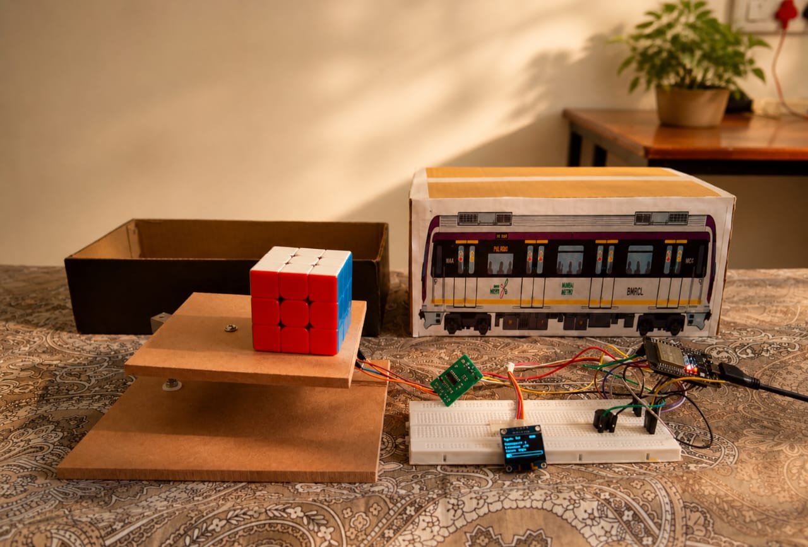

#  Real-Time Metro Coach Occupancy Monitoring System

[](https://www.arduino.cc/)
[](https://blynk.io/)
[]()
[]()

> A weight-based IoT system that monitors metro coach occupancy in real-time — **100x cheaper** than existing solutions!

---

##  Project Image

| Circuit 
|  

---

##  Problem
Passengers on metro platforms have **no way of knowing** which coach is less crowded. Existing solutions cost **₹50,000 to ₹2,00,000** per coach.

##  Solution
Weight-based IoT system that detects passenger count and sends real-time data to **Blynk dashboard** and **Google Sheets** — all for under **₹2,000!**

---

##  Achievement
-  **3rd Place** at Circuitrix 3.0 Project Exhibition
-  Evaluated by **Bosch engineer** (12 years experience)
-  **IEEE Research Paper** in progress

---

##  Hardware

| Component | Purpose |
|---|---|
| ESP32 DevKit V1 | Brain + WiFi |
| Load Cell 5kg | Measures weight |
| HX711 Amplifier | Amplifies signal 128x |
| SSD1306 OLED | Live display |
| Active Buzzer | Overcapacity alert |

---

##  Pin Connections

| Component | Pin | ESP32 |
|---|---|---|
| HX711 | DT | GPIO 18 |
| HX711 | SCK | GPIO 19 |
| OLED | SDA | GPIO 21 |
| OLED | SCL | GPIO 22 |
| Buzzer | + | GPIO 23 |

---

## Libraries
Adafruit SSD1306 | Adafruit GFX | HX711
WiFi | BlynkSimpleEsp32 | HTTPClient


---

## How to Run

1. Clone this repo
2. Install libraries listed above
3. Update credentials in code:
```cpp
char ssid[] = "YOUR_WIFI";
char pass[] = "YOUR_PASSWORD";
#define BLYNK_AUTH_TOKEN "YOUR_TOKEN"
const char* SHEET_URL = "YOUR_APPS_SCRIPT_URL";
scale.set_scale(-500448); // calibration factor
```
4. Upload to ESP32
5. Open Serial Monitor at **115200 baud**

---

## How it Works

Load Cell → HX711 → ESP32 → OLED Display
→ Blynk Dashboard (every 500ms)
→ Google Sheets (every 10 sec)
→ Buzzer Alert (when FULL)


---
##  Status Levels

| Occupancy | Status |
|---|---|
| 0 - 49% | 🟢 GOOD |
| 50 - 79% | 🟡 MODERATE |
| 80 - 99% | 🟠 CROWDED |
| 100% | 🔴 FULL + Buzzer! |

---

## Team
- Tanish
- Nithin J
- Tushar R

---

## Acknowledgements
- Professor Nagaraj — guidance and IEEE paper recommendation
- Bosch industry expert — evaluation and feedback
- RV University — Centre of Excellence in IoT & Edge Computing

---
 Star this repo if you found it helpful!
